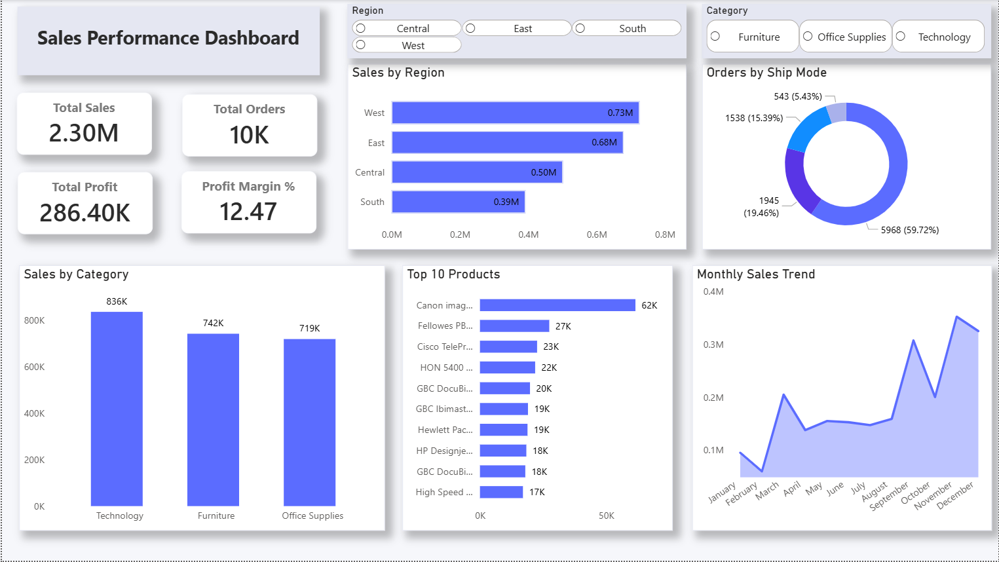

# 📊 Sales Performance Analytics Dashboard

An interactive Business Intelligence dashboard built using **Power BI, SQL, and Excel** to analyze sales, profit, customer behavior, and product performance.

This project helps businesses track KPIs, identify top-performing regions/products, and uncover revenue opportunities through data-driven insights.

---

## 🔥 Project Overview

The dashboard provides a complete sales performance analysis including:

✔ Total Sales  
✔ Total Orders  
✔ Total Profit  
✔ Profit Margin  
✔ Regional Performance  
✔ Category Analysis  
✔ Top Products  
✔ Monthly Sales Trend  
✔ Ship Mode Distribution  

Designed with a clean and professional layout for real-world business use.

---

## 🛠 Tools & Technologies

- Power BI
- SQL (MySQL)
- Excel
- DAX
- Data Modeling
- Data Visualization

---

## 📈 Key Features

- KPI cards for business metrics
- Interactive slicers (Region, Category)
- Bar charts for regional/category sales
- Donut chart for shipping mode distribution
- Top 10 products ranking
- Monthly sales trend analysis
- Clean modern dashboard UI

---

## 🧠 Business Insights

- West region generates highest revenue
- Technology category leads sales
- Few products contribute majority of revenue (Pareto effect)
- Monthly sales show upward trend in Q4

---

## 📷 Dashboard Preview

